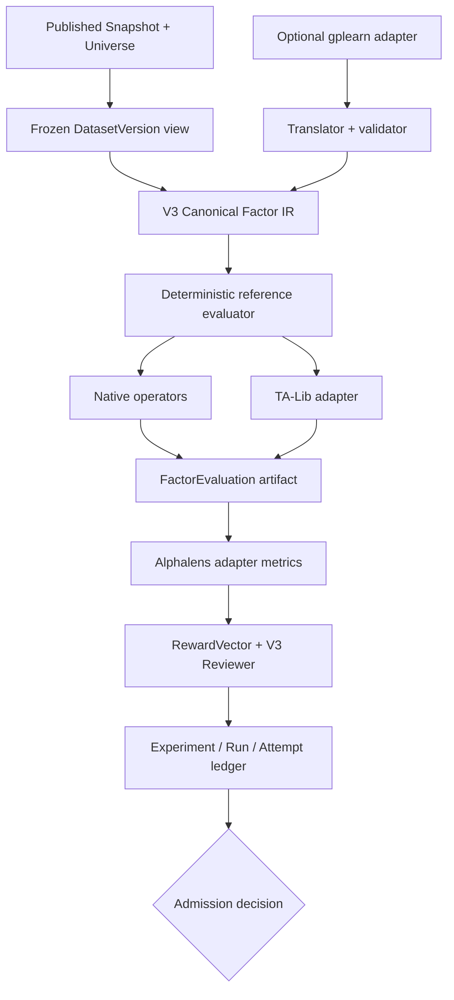

# V3 Factor / Alpha Mining Reuse-First 工程研究

任务：`V3-FACTOR-ALPHA-MINING-REUSE-FIRST-01`

研究日期：2026-08-11（Asia/Shanghai）

V3 基线：`266dd1b5c014949bb3bdfdf4096c4c06ac693a31`

## 1. 结论

V3 不应 fork AlphaGPT，也不应先建设通用 StackVM 或完整 `AlphaMiningWorker`。当前最小可靠路线是：

1. V3 原生拥有 Canonical Factor IR、operator semantic version、PIT/available-time、missing semantics、canonical identity、Experiment/Artifact/Admission；
2. 技术指标直接依赖 TA-Lib，但必须经过 V3 operator adapter 固化 lookback、missing 和错误语义；
3. Qlib 只作为固定 Python 3.12 环境的隔离 worker，输入 V3 冻结视图，输出非权威计算结果；
4. alphalens-reloaded 作为 Factor Evaluation adapter，不能自行定义 Dataset、forward label、正式指标身份或 Admission；
5. V0 symbolic generation 优先采用 gplearn adapter；AlphaGen 仅作算法设计参考；PySR 留作未来隔离 worker；
6. PydanticAI 继续作为 Agent SDK，但 V3 Control Plane 仍是 Task/Run/Attempt、权限、审批与持久化权威；
7. 先完成 Track C 的 Canonical IR、确定性 reference evaluator、TA-Lib adapter 和 V3-owned evaluation/reviewer artifacts，再决定是否需要独立 mining worker。

因此本任务只形成研究与设计决策，不实现 AlphaMiningWorker、Factor Agent、第二套 Factor IR、第二套 Truth State 或 shadow engine。

## 2. V3 边界与现状

本次研究从当前 `origin/main` 创建独立研究分支。GitHub CURRENT 在开始和 context recovery 时均显示：零个 open PR；main 的 CI run `31325929369` 对基线 SHA 成功。既有 Factor/Dataset、Truth/Admission、Strategy IR、Portfolio/Risk 研究已经合并或不存在 open PR，因此本报告没有 owner/write-set 冲突。

当前仓库仍处于 PRE-ALPHA / ACTIVE RECONSTRUCTION。现有 Control Catalog 已定义 FactorDefinition、FactorVersion、DatasetSpec、DatasetVersion、Study、Trial、Experiment、BacktestRunSpec 等 owner 和持久化轮廓，但未来 Factor Canonical IR 与 `FactorDefinitionVersion != FactorEvaluation != FeatureMaterialization` 的正式运行契约仍需 Track C 建设。

保持以下不可外包边界：

- V3 Canonical Contract、canonical identity/version；
- PIT / available-time、Truth / Admission；
- Artifact / Provenance、Task / Permission；
- 正式 DatasetVersion、FactorDefinitionVersion、Experiment identity；
- A 股日历、复权、停牌、涨跌停、成分股历史和可交易性语义；
- `FactorCandidate != Canonical Factor`，mining reward 不等于 Truth，第三方不得 Publish。

Context7 MCP 在本执行环境中不可用；库/API CURRENT 核对改用官方仓库、官方文档、PyPI 元数据和论文原始页面。该限制不改变采用结论，但在实施依赖前应由 Track C 再锁定发布版本并生成可复现 lockfile。

## 3. Reviewed revisions 与发布版本

下表的 Git SHA 均为 2026-08-11 实际核对的默认分支 HEAD；版本为同日 PyPI 元数据中的最新稳定发布（若有）。

| 候选 | Reviewed SHA / version | License | CURRENT 与平台事实 |
|---|---|---|---|
| [AlphaGPT](https://github.com/imbue-bit/AlphaGPT) | `d851f2221dcaf4d53a707344f68ae6801e3e5af5` | Apache-2.0 | 活跃但无测试目录；主实现是 crypto/meme-token 实验；仓库另有单文件 Tushare 实验 |
| [Qlib](https://github.com/microsoft/qlib) | `79633dd9506ea689e5400dea0197717b5b3d74b7`; `pyqlib==0.9.7` | MIT | 官方支持 Python 3.8–3.12；PyPI 无 CPython 3.14 Windows wheel |
| [TA-Lib Python](https://github.com/TA-Lib/ta-lib-python) | `a9ff1b47b3ddbd57274116645d688c0ed677338b`; `TA-Lib==0.7.1` | BSD-2-Clause | 官方 wheel 覆盖 Windows 与 CPython 3.9–3.14 |
| [TA-Lib core](https://github.com/TA-Lib/ta-lib) | `c83a2852335ebf21668f94ebe2237cd9a0ad599d` | BSD-3-Clause | 成熟 C 指标实现 |
| [alphalens-reloaded](https://github.com/stefan-jansen/alphalens-reloaded) | `f0a07c22d554e4b4036983cc80320b432714fe7e`; `0.4.6` | Apache-2.0 | Python `>=3.10` pure wheel；维护强于已停滞的原 Quantopian 项目 |
| [RD-Agent](https://github.com/microsoft/RD-Agent) | `6762f84f9bc0f5c6486c50a00e128a57ac6c3683`; `0.8.0` | MIT | 官方仅支持 Linux；Docker 为主要执行环境；CI 重点覆盖 Python 3.10/3.11 |
| [vn.py](https://github.com/vnpy/vnpy) | `fa5206fe63836f3f8cd1ebd7168fbd19a5e2ff09`; `4.4.0` | MIT | 活跃、A 股生态成熟，包含 `vnpy.alpha`，但同时拥有自己的数据/研究/回测抽象 |
| [Hikyuu](https://github.com/fasiondog/hikyuu) | `7e1a61d98cf4efa5dbac5a4feab749e28dbe5b95`; `2.8.1` | Apache-2.0 | 活跃、C++/Python、深度适配 A 股；自带数据、指标、策略与回测体系，集成成本高 |
| [gplearn](https://github.com/trevorstephens/gplearn) | `0390aea8639ce5f6c0b388400e07b58c05acad6a`; `0.4.3` | BSD-3-Clause | `SymbolicTransformer`/GP，Python `>=3.11` pure wheel；无 PIT/时间序列金融语义 |
| [PySR](https://github.com/MilesCranmer/PySR) | `b89f9209d8ead59974bcff8f0f295b71c4a8fb7c`; `1.5.10` | Apache-2.0 | Python 包会启动 Julia 并在首次 import 安装 Julia 依赖；支持复杂度与嵌套约束 |
| [DEAP](https://github.com/DEAP/deap) | `8a96fd3a75026f7b30e835f595a5199c75634ddf`; `1.4.4` | LGPL-3.0 | 支持 strongly typed GP 与 NSGA-II/III；许可证和自定义工作量不适合 V0 直接依赖 |
| [AlphaGen](https://github.com/ICT-FinD-Lab/alphagen) | `259687e8f316994426416c530a94842a2fe6405e` | 未发现 LICENSE | 语法约束、action mask、alpha pool 设计优于 AlphaGPT；代码不得复用 |
| [AlphaForge](https://github.com/DulyHao/AlphaForge) | `d0cfc27df23c60f271bc885fd43027b86b787746` | 未发现 LICENSE | 论文有价值，仓库维护和法律可复用性不足 |
| [alpha-gfn](https://github.com/nshen7/alpha-gfn) | `b0f415c155d3c4e0447f3231bde95f0f95b6d449` | 未发现 LICENSE | 早期研究/notebook 形态，不能进入生产依赖链 |
| [PydanticAI](https://github.com/pydantic/pydantic-ai) | `d995cfee9fa4243e3a6f5d8e6762b841f7fde839`; `2.27.0` | MIT | Python `>=3.10` pure wheel；typed output/tool、OTel、human approval 和 durable execution 能力成熟 |

版本必须在实现 PR 中锁定；本报告不修改依赖文件。

## 4. AlphaGPT 专项结论

### 4.1 `model_core` 主路径

实际源码显示：

- `vocab.py` / `ops.py` 是固定、未版本化的 feature/operator 表；
- `engine.py` 让 Transformer 生成固定长度 token，再对无效公式施加事后惩罚，不是严格 grammar/action masking；
- `vm.py` 是 postfix stack evaluator，但捕获宽泛异常并返回 `None`，同时把 NaN/Inf 静默替换为有限数；
- `data_loader.py` 直接连接 PostgreSQL crypto 数据，先全局 forward-fill 再补零，并用未来 roll 构造 target；
- `backtest.py` 是简化 meme-token long-only reward/backtest；训练和 best tracking 使用同一数据，缺少独立 reviewer、完整 trial ledger、multiple-testing 处理；
- operator 没有 semantic version、available-time、依赖签名、missing contract 或 provenance。

这些行为与 V3 的 fail-closed、PIT、missing semantics 和可审计 Experiment identity 冲突。StackVM 体量小不等于值得抽取：其关键语义恰好是 V3 不能接受的 silent fallback。

### 4.2 `times.py` Tushare 路径

仓库根部的单文件实验并非主框架的 A 股实现：它只处理一个 ETF，并存在以下问题：

- 公共源码中嵌入了第三方 API 凭证；本报告不复制该值；
- split 前执行 `ffill + bfill`，会把未来值带回过去；
- robust normalization 使用全样本统计量，train/test 相互泄漏；
- reward 在训练窗口上优化 Sortino，缺少完整候选/试验计数和 OOS reviewer；
- VM 仍宽泛捕获异常并 `nan_to_num`；
- 涨跌停和 benchmark 对齐只是近似，图表 benchmark 标识与实际代码不一致。

该文件的严格 action masking 比 `model_core` 更接近有效 constrained generation，但数据和评价语义不具备可采用性。

### 4.3 Provenance

仓库 `paper/20251226.pdf` 经文本提取和页面渲染核对，标题是 “Defense in Predatory Markets: A Differential Game Framework for AMM Liquidity via Uniswap V4 Hooks”，不是 AlphaGPT 或 A 股 alpha mining 论文。仓库未提供可复现测试链来连接代码、论文和结果。

**唯一采用结论：`REJECT`。** 不直接依赖、不 fork、不建 AlphaGPT worker、不抽取 VM/训练/回测源码。只保留“constrained formula generation → deterministic evaluation → reward-driven search”这一通用问题分解作为背景知识，不构成代码或架构采用。

## 5. Adoption Gate

每个候选只有一个工程建议；“设计参考”不授予任何 V3 Authority。

| 候选 | 唯一建议 | Gate 结论 |
|---|---|---|
| AlphaGPT | `REJECT` | silent fallback、泄漏、无测试、凭证与论文 provenance 问题超过可修复价值；有更优替代 |
| Qlib | `ISOLATED_WORKER_API_CLI` | expression/rolling/analysis 能力强且有测试，但字符串解析使用 Python `eval`，并带 provider/cache/workflow authority；Python 3.14 不兼容 |
| TA-Lib Python/core | `DIRECT_DEPENDENCY` | 成熟、许可宽松、Windows/Python 3.14 wheel 完整；通过 V3 adapter 明确 lookback、NaN 和 unstable-period 行为 |
| alphalens-reloaded | `ADAPTER` | 可复用 returns/IC/turnover/group analysis；必须使用 V3 预制 frozen inputs 和 label，结果转成 V3 artifact |
| 原 Quantopian Alphalens | `REJECT` | 上游长期停滞，已有维护中的 reloaded 替代 |
| RD-Agent | `DESIGN_ALGORITHM_REFERENCE` | R&D loop 有参考价值；Linux/Docker/LLM/代码执行和自身缓存/流程会形成第二 Control Plane |
| vn.py / `vnpy.alpha` | `DESIGN_ALGORITHM_REFERENCE` | A 股表达式与数据处理经验有价值；不得引入其数据、回测和 engine authority |
| Hikyuu | `DESIGN_ALGORITHM_REFERENCE` | A 股语义和高性能组件有价值；整框架依赖会复制 V3 数据/策略/回测权威 |
| gplearn | `ADAPTER` | V0 最小 GP generator；只接收 V3 预计算 terminal，program 必须翻译并验证为 V3 IR，不能直接执行/发布 |
| PySR | `ISOLATED_WORKER_API_CLI` | 高性能、多目标/复杂度约束强；Julia 子进程、toolchain、checkpoint 状态不应进入核心进程 |
| DEAP | `DESIGN_ALGORITHM_REFERENCE` | strongly typed GP、bloat control、NSGA 系列值得借鉴；LGPL 与 V0 定制成本不优于 gplearn |
| AlphaGen | `DESIGN_ALGORITHM_REFERENCE` | grammar/action mask、组合增益、IC/相关性 pool 思路最适合 mining 设计；仓库无许可证，禁止复制源码 |
| AlphaForge | `REJECT` | 论文可阅读，但仓库无许可证、维护弱；V0 不需要其生成预测双网络 |
| alpha-gfn | `REJECT` | 无许可证、早期 notebook 形态，生产 gate 不通过 |
| PydanticAI | `DIRECT_DEPENDENCY` | typed tool/output、approval、OTel 适合 Agent SDK；禁用其 task/durable store 作为 V3 第二持久化权威 |

### 5.1 Gate 维度摘要

- **确定性**：所有 generator 必须固定 seed、版本、operator registry、输入 artifact hash、资源限制并保留完整候选流；同输入重放不得依赖外部 cache 的隐式状态。
- **PIT / missing**：没有一个候选可替代 V3 available-time authority。TA-Lib 的初始 lookback NaN 和后续 NaN 传播、Qlib 的扩展窗口、Alphalens 的 forward return cleaning 都必须被 adapter 契约化。
- **版本绑定**：记录 repo SHA/package version、Python/runtime、平台、operator semantic version、translator version、random seed 和 environment artifact。
- **可观察性**：worker 只能发结构化 progress/result/error event；不得吞异常或返回伪成功。
- **第二 Authority**：第三方 provider/cache/experiment/checkpoint/agent durable store 只能作为 Attempt 内部临时状态，不能分配 V3 identity 或决定 Admission。
- **许可证**：未发现 LICENSE 的 AlphaGen/AlphaForge/alpha-gfn 代码按不可复用处理；DEAP 的 LGPL 使 V0 直接依赖收益不足；允许阅读论文并独立实现 V3 invariants。

## 6. Capability Adoption Matrix

| Capability | Decision | 具体落点 |
|---|---|---|
| Technical indicators | `DIRECT_DEPENDENCY` | TA-Lib 0.7.1 + V3 operator adapter |
| Factor expression | `V3_NATIVE_REQUIRED` | Canonical typed AST/IR、parser/validator/translator；Qlib/vn.py 只提供参考和 worker backend |
| Symbolic alpha generation | `ADAPTER` | V0 gplearn adapter；未来 PySR isolated worker；AlphaGen 算法参考 |
| Formula VM | `REJECT` | 不采用 AlphaGPT VM，不自建通用 VM；小型 typed AST 使用确定性 reference evaluator |
| Factor analysis | `ADAPTER` | alphalens-reloaded；Qlib analysis 可在 isolated worker 中补充 |
| Research loop | `V3_NATIVE_REQUIRED` | V3 Task/Run/Attempt/Artifact/Permission/Reviewer orchestration；RD-Agent 仅参考 |
| Agent SDK | `DIRECT_DEPENDENCY` | PydanticAI，受 V3 Control Plane 约束 |
| PIT / Truth | `V3_NATIVE_REQUIRED` | Snapshot/Universe/available-time/Truth/Admission |
| Factor Canonical IR | `V3_NATIVE_REQUIRED` | V3 identity、operator semantic version、dependency signature、missing/availability semantics |
| Experiment identity | `V3_NATIVE_REQUIRED` | V3 Experiment/Run/Attempt/Artifact；禁止 Qlib/worker ID 成为 canonical identity |

## 7. 复用分层答案

### 7.1 直接依赖

- TA-Lib：技术指标计算；所有调用仍经过 operator adapter。
- PydanticAI：Research/Data/Reviewer Agent 的 typed tool/output SDK；V3 继续拥有持久化、权限和审批。

### 7.2 Adapter

- TA-Lib operator adapter：输入类型、lookback、lag、unstable period、NaN、error、output schema。
- alphalens-reloaded evaluation adapter：只消费 V3 frozen factor/label/universe input，输出非权威 metrics payload。
- gplearn mining adapter：只消费 V3 预计算 terminal matrix；产物是 external program/candidate，经 translator 成为待验证 V3 IR。
- 所有 adapter 必须记录 dependency/package version、translator version、input/output artifact hash。

### 7.3 Worker / API / CLI 隔离

- Qlib：固定 Python 3.12 worker，禁止直接读取 V3 provider/catalog；只读 content-addressed frozen view，输出 artifact；关闭/隔离其全局 provider、cache、workflow/recorder authority。
- PySR：未来可用独立 Julia worker；V0 不引入。
- RD-Agent 不是近期 worker 候选；若未来试验，只能作为非权威 proposal engine，且默认断网、受权限与资源限制。

### 7.4 Selective source extraction

V0 **不需要源码抽取**。TA-Lib/gplearn/Alphalens/PydanticAI 可用依赖或 adapter；Qlib/PySR 可隔离；AlphaGen 等无许可证仓库不能抽取；AlphaGPT 没有值得承担 provenance 和语义风险的独特模块。

### 7.5 只借设计/算法

- AlphaGen：typed token/action mask、候选池相关性约束、按组合边际贡献奖励；其论文明确优化协同 alpha 集合而非单因子。
- DEAP：strongly typed GP、bloat control、NSGA/Pareto。
- PySR：operator/nested constraints、complexity pricing、多 population 搜索。
- vn.py/Hikyuu：A 股 operator、rolling、数据处理与高性能实现经验。
- RD-Agent：proposal → experiment → feedback 的研究循环，但不用其 control/runtime authority。

### 7.6 V3 必须原生

- Canonical Factor IR 和 semantic versioned operator registry；
- FactorDefinitionVersion identity、dependency signature、lookback/lag/availability/missing/complexity；
- Snapshot/Universe/DatasetVersion 绑定在 FactorEvaluation，不进入定义身份；
- PIT/available-time、A 股日历/复权/停牌/涨跌停/成分历史；
- deterministic validation/compiler/reference evaluator；
- Experiment/Run/Attempt、Artifact/Provenance、Permission、Reviewer、Truth/Admission；
- RewardVector schema、hard gates 与正式 reviewer policy。

## 8. Factor Runtime：不建设通用 VM

V3 真正缺失的是 canonical semantics，不是另一台通用虚拟机。V0 采用小型 closed-world typed AST：

```text
External expression / GP program
             ↓
versioned translator
             ↓
V3 Canonical Factor IR
             ↓
schema + type + dependency + PIT validation
             ↓
deterministic reference evaluator
       ┌─────┴─────┐
       ↓           ↓
native arithmetic  TA-Lib operator adapter
```

reference evaluator 的目标是可验证和重放，不是最大性能。只有在 operator coverage、性能 profile 或资源隔离证据出现后，才添加 backend interface；Qlib worker 仍不能绕过 V3 IR/validation。禁止 `eval`、动态 import、宽泛 exception → null、NaN/Inf 静默替换。

## 9. RewardVector 与 Reviewer

### 9.1 V0 RewardVector

Reward 不应被单一训练收益取代。每次候选评估保留完整 vector：

- `rank_ic_mean`, `ic_mean`, `icir`；
- quantile return、long/short spread；
- turnover、decay、coverage；
- year/regime stability；
- cost-adjusted return、drawdown；
- complexity；
- 与已接纳/候选池因子的 correlation/redundancy；
- sample sufficiency；
- multiple-testing / overfitting diagnostics。

先执行 hard gates：PIT、leakage、coverage、样本数、有效数值、operator/complexity 上限。generator 内部可使用仅训练期的确定性 surrogate（如 RankIC/ICIR 减 turnover、complexity、redundancy），但 V3 artifact 保留全 vector。

### 9.2 V0 选择方式

推荐 **Pareto archive + 确定性 lexicographic tie-break**，不把全 vector 永久压成一组主观权重。V0 可限制 archive 大小和 objective 数量；weighted scalar 只作为 generator feedback，不是正式 Admission score。

### 9.3 Anti-overfitting

Reviewer 至少同时检查：look-ahead、leakage、survivorship、样本不足、regime/OOS instability、redundancy、complexity/bloat、turnover、cost sensitivity、selection bias 和 data snooping。

论文依据：

- Bailey et al. 的 Probability of Backtest Overfitting 使用 CSCV 估计 PBO；
- Bailey 与 López de Prado 的 Deflated Sharpe Ratio 校正多重试验、选择偏差和非正态收益；
- Harvey、Liu、Zhu 说明因大量 factor mining，传统显著性阈值不足。

因此 V3 必须记录**全部尝试过的候选和失败**。若只保存 best candidate，DSR/PBO 所需的试验数量、候选相关性和选择过程证据会永久丢失。

## 10. Track C 调整

### 实现

1. Canonical Factor IR、operator registry/semantic version、type/dependency signature；
2. definition validator 与 external-expression translator contract；
3. 小型 deterministic reference evaluator；
4. TA-Lib operator adapter；
5. `FactorEvaluation`、`RewardVector`、review artifact schema，并保持与 FeatureMaterialization 分离；
6. Qlib isolated-worker port（先定义契约和安全边界，非立即实现完整 worker）；
7. 将 Snapshot/Universe/DatasetVersion、knowledge cutoff 和 environment 绑定在 evaluation/run，不进入 FactorDefinitionVersion。

### 删除/避免

- 不把代码文件/hash 当作唯一 factor semantic identity；
- 不引入动态 `eval` 或 AlphaGPT StackVM；
- 不引入 shadow provider/cache/experiment registry；
- 不允许 backend 的 null/zero fallback 冒充成功；
- 不为 AlphaGPT 整体 fork 或复制 Qlib engine。

### 复用

- 现有 Factor/Dataset/Study/Trial/Experiment/Artifact/Task/Truth owners；
- TA-Lib 指标；
- alphalens-reloaded 分析；
- Qlib expression/rolling/analysis 作为隔离 backend；
- gplearn 作为 bounded V0 generator adapter。

## 11. Track D 调整

现在只需要兼容未来调用面，不需要构建 Factor Agent 或 autonomous loop：

- Research Agent 可提出 typed `FactorHypothesis` / `AlphaMiningRequest`；
- Data Agent 只解析所需 Snapshot/Universe/DatasetVersion，不向 miner 交出 provider authority；
- Reviewer Agent 只解释 V3 reviewer artifacts，不能自行 Admission；
- PydanticAI tool 调用必须落入 V3 Task/Run/Attempt，并受 permission/approval；
- 不采用 PydanticAI durable execution、RD-Agent loop 或 miner checkpoint 作为第二 Control Plane。

`AlphaMiningWorker` 不是现在的前置条件。只有当候选搜索已通过 bounded adapter 原型证明需要独立资源、长时运行、Julia/Qlib runtime 或故障隔离时，再把 backend 提升为 worker。

## 12. 最小 V0 vertical slice



执行顺序：

1. 手工构造 2–3 个 Factor IR golden cases；
2. 在一个严格冻结的 Snapshot/Universe/DatasetVersion 上运行小 operator subset；
3. native arithmetic 与 TA-Lib adapter 产生可重放 FeatureMaterialization；
4. alphalens adapter 计算 exploratory metrics，V3 转存为 FactorEvaluation/RewardVector；
5. reviewer 执行 PIT、coverage、OOS、cost、complexity、redundancy hard gates；
6. Experiment/Run/Attempt 保存每个候选，包括失败；
7. 最后才接入 gplearn adapter 生成有限候选，所有 program 必须经 translator/validator。

该 slice 不需要 AlphaMiningWorker、LLM generator、PySR、RD-Agent、Qlib provider、通用 VM 或自动 Publish。

## 13. 主要风险与控制

| 风险 | 候选 | 控制 |
|---|---|---|
| Authority 重叠 | Qlib、RD-Agent、vn.py、Hikyuu、PydanticAI durable execution | 只允许 adapter/worker Attempt；V3 分配 identity、记录 artifact、审批和 Admission |
| PIT/lookahead | AlphaGPT、所有 generator、Qlib extended window、Alphalens forward returns | V3 frozen view、available-time validator、purged/OOS split、禁止全样本 fill/scale |
| missing/silent fallback | AlphaGPT VM、TA-Lib NaN propagation、第三方 data cleaning | fail-closed typed errors；adapter 明确 missing contract；禁止 `nan_to_num` 默认成功 |
| License | AlphaGen、AlphaForge、alpha-gfn、DEAP | 无 LICENSE 不复制；DEAP 仅参考；在 SBOM/lockfile 记录 transitive license |
| Maintenance/runtime | 原 Alphalens、RD-Agent Linux-only、PySR Julia、Qlib Python 3.12 ceiling | 用 reloaded；隔离 runtime；pin SHA/version/image digest；health/replay tests |
| Reproducibility | GP/RL/LLM、多进程、worker cache | seed、operator registry、environment、resource limit、完整 candidate ledger、artifact hash |
| Overfitting | 所有自动 mining | trial ledger、PBO/DSR、multiple-testing、OOS/regime/cost/redundancy reviewer |
| Secret/provenance | AlphaGPT | 不复用；secret scanning；只接受可验证 source/paper/result lineage |

## 14. 状态与停止边界

本报告完成 Reuse Scan、Adoption Gate、Capability Adoption Matrix、Track C/D 调整和 V0 架构决策。未进行任何运行时代码、依赖或 canonical contract 修改。

明确停止：

- `NOT_RUN`：AlphaMiningWorker、Factor Agent、自主研究循环、Qlib/PySR worker、gplearn/TA-Lib/Alphalens runtime prototype；
- `PENDING`：Track C owner 审核后另开 implementation task，锁定依赖并为 V0 写 executable contract tests；
- `BLOCKED`：本任务环境中的 GitHub CLI token 无效；push/PR/branch CI 的实际状态必须以最终 ledger 为准。

## 15. Primary sources

- [AlphaGPT source](https://github.com/imbue-bit/AlphaGPT/tree/d851f2221dcaf4d53a707344f68ae6801e3e5af5)
- [Qlib source and supported Python versions](https://github.com/microsoft/qlib/tree/79633dd9506ea689e5400dea0197717b5b3d74b7)
- [Qlib expression provider using `eval(parse_field(...))`](https://github.com/microsoft/qlib/blob/79633dd9506ea689e5400dea0197717b5b3d74b7/qlib/data/data.py)
- [TA-Lib Python wheels, lookback and NaN behavior](https://github.com/TA-Lib/ta-lib-python)
- [alphalens-reloaded](https://github.com/stefan-jansen/alphalens-reloaded)
- [RD-Agent platform requirements](https://github.com/microsoft/RD-Agent/blob/main/README.md)
- [vn.py](https://github.com/vnpy/vnpy) and [Hikyuu](https://github.com/fasiondog/hikyuu)
- [gplearn documentation](https://gplearn.readthedocs.io/en/stable/) and [PySR](https://github.com/MilesCranmer/PySR)
- [DEAP strongly typed GP](https://deap.readthedocs.io/en/stable/tutorials/advanced/gp.html)
- [AlphaGen paper](https://arxiv.org/abs/2306.12964) and [AlphaForge paper](https://arxiv.org/abs/2406.18394)
- [PydanticAI official documentation](https://ai.pydantic.dev/)
- [Probability of Backtest Overfitting](https://papers.ssrn.com/sol3/papers.cfm?abstract_id=2326253)
- [Deflated Sharpe Ratio](https://papers.ssrn.com/sol3/papers.cfm?abstract_id=2460551)
- [Harvey, Liu, Zhu, “... and the Cross-Section of Expected Returns”](https://doi.org/10.1093/rfs/hhv059)
