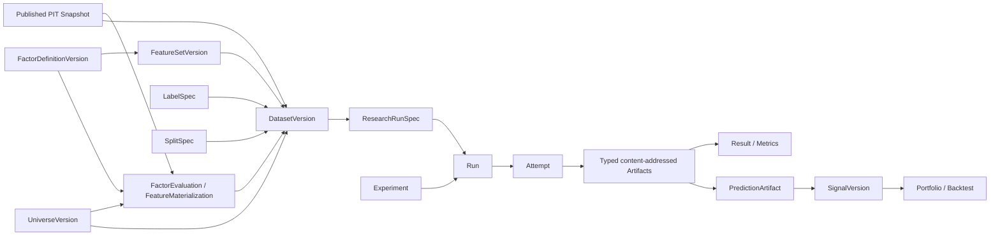

# Factor / Dataset / Research / Experiment OSS Reference Matrix

## 研究边界与基线

- V3 基线：`origin/main@0ca98311b15971ea31039c6faed1a3be09a40357`，于 2026-08-10 在执行 `git fetch origin` 后记录。
- 目标问题：V3 如何从 `Published PIT Snapshot + UniverseVersion` 建立 `Factor → Dataset → Research Run → Experiment/Recorder → Artifact`，同时保持 V3 是唯一 authority。
- 第一参考是 Qlib；OpenBB 仅补充 canonical provider/API 边界；vn.py 仅补充 `vnpy.alpha` 的本地因子研究工作流。未扩展到无直接关系的调度、交易网关或通用 MLOps 项目。
- 本研究只吸收行为、架构边界与测试思想。没有复制上游源码或测试夹具，也不建议在本任务修改正式 17-ASL contract。

结论分类：

- `ADOPT_INVARIANT`：V3 应作为 fail-closed invariant 直接拥有。
- `ADAPT_TO_V3`：成熟经验有价值，但必须绑定 V3 identity、PIT、Artifact、Run/Attempt 与 provenance。
- `REJECT_NOT_V3_FIT`：与 V3 authority、安全或可证明性冲突。
- `FUTURE_ONLY`：方向合理，但不是 Factor/Dataset 第一实施切片的阻塞项。

## 可复核来源、固定 revision 与许可证

| 项目 | 固定 revision | 实际核验范围 | License | 本研究使用方式 |
|---|---|---|---|---|
| Qlib | [`79633dd9506ea689e5400dea0197717b5b3d74b7`](https://github.com/microsoft/qlib/tree/79633dd9506ea689e5400dea0197717b5b3d74b7) | Data/Calendar/Instruments；Expression/Feature/ops/cache；DatasetH/DataHandlerLP/processors/segments；PIT 文档；workflow/Experiment/Recorder/record templates；Model/prediction/signal/backtest；官方测试 | MIT | 第一参考；行为与测试思想 |
| OpenBB | [`3e071fcc2cd9f891cac6040ae60296dba76dab46`](https://github.com/OpenBB-finance/OpenBB/tree/3e071fcc2cd9f891cac6040ae60296dba76dab46) | QueryParams/Data、Fetcher TET、Provider Registry/RegistryMap、QueryExecutor、AnnotatedResult/OBBject 与对应测试 | AGPL-3.0 | 只做设计研究；不复用实现 |
| vn.py / `vnpy.alpha` | [`fa5206fe63836f3f8cd1ebd7168fbd19a5e2ff09`](https://github.com/vnpy/vnpy/tree/fa5206fe63836f3f8cd1ebd7168fbd19a5e2ff09) | AlphaDataset、AlphaLab、表达式、Alpha158、processors、model、signal/backtesting、官方 alpha 文档与测试 | MIT | 本地研究 ergonomics 与失败模式参考 |
| V3 | `0ca98311b15971ea31039c6faed1a3be09a40357` | future backend contract、17-ASL、Control Catalog、Artifact publication/policy/reachability、Task/Run/Attempt、provenance | Apache-2.0 | 唯一产品 authority 与落点 |

关键 Qlib 证据包括 [`Expression`/`Feature`](https://github.com/microsoft/qlib/blob/79633dd9506ea689e5400dea0197717b5b3d74b7/qlib/data/base.py)、[`ops`](https://github.com/microsoft/qlib/blob/79633dd9506ea689e5400dea0197717b5b3d74b7/qlib/data/ops.py)、[`LocalDatasetProvider`](https://github.com/microsoft/qlib/blob/79633dd9506ea689e5400dea0197717b5b3d74b7/qlib/data/data.py)、[`DatasetH`](https://github.com/microsoft/qlib/blob/79633dd9506ea689e5400dea0197717b5b3d74b7/qlib/data/dataset/__init__.py)、[`DataHandlerLP`](https://github.com/microsoft/qlib/blob/79633dd9506ea689e5400dea0197717b5b3d74b7/qlib/data/dataset/handler.py)、[`processors`](https://github.com/microsoft/qlib/blob/79633dd9506ea689e5400dea0197717b5b3d74b7/qlib/data/dataset/processor.py)、[`Recorder`](https://github.com/microsoft/qlib/blob/79633dd9506ea689e5400dea0197717b5b3d74b7/qlib/workflow/recorder.py)、[`record templates`](https://github.com/microsoft/qlib/blob/79633dd9506ea689e5400dea0197717b5b3d74b7/qlib/workflow/record_temp.py)、[`signal`](https://github.com/microsoft/qlib/blob/79633dd9506ea689e5400dea0197717b5b3d74b7/qlib/backtest/signal.py)、[`dataset tests`](https://github.com/microsoft/qlib/blob/79633dd9506ea689e5400dea0197717b5b3d74b7/tests/data_mid_layer_tests/test_dataset.py) 与 [`all-pipeline workflow test`](https://github.com/microsoft/qlib/blob/79633dd9506ea689e5400dea0197717b5b3d74b7/tests/test_all_pipeline.py)。

OpenBB 的直接证据是 [`Fetcher`](https://github.com/OpenBB-finance/OpenBB/blob/3e071fcc2cd9f891cac6040ae60296dba76dab46/openbb_platform/core/openbb_core/provider/abstract/fetcher.py)、[`Data`](https://github.com/OpenBB-finance/OpenBB/blob/3e071fcc2cd9f891cac6040ae60296dba76dab46/openbb_platform/core/openbb_core/provider/abstract/data.py)、[`RegistryMap`](https://github.com/OpenBB-finance/OpenBB/blob/3e071fcc2cd9f891cac6040ae60296dba76dab46/openbb_platform/core/openbb_core/provider/registry_map.py) 与 [`QueryExecutor`](https://github.com/OpenBB-finance/OpenBB/blob/3e071fcc2cd9f891cac6040ae60296dba76dab46/openbb_platform/core/openbb_core/provider/query_executor.py)。vn.py 的直接证据是 [`AlphaDataset`](https://github.com/vnpy/vnpy/blob/fa5206fe63836f3f8cd1ebd7168fbd19a5e2ff09/vnpy/alpha/dataset/template.py)、[`AlphaLab`](https://github.com/vnpy/vnpy/blob/fa5206fe63836f3f8cd1ebd7168fbd19a5e2ff09/vnpy/alpha/lab.py)、[`processors`](https://github.com/vnpy/vnpy/blob/fa5206fe63836f3f8cd1ebd7168fbd19a5e2ff09/vnpy/alpha/dataset/processor.py) 与 [`expression utility`](https://github.com/vnpy/vnpy/blob/fa5206fe63836f3f8cd1ebd7168fbd19a5e2ff09/vnpy/alpha/dataset/utility.py)。

## Authority 结论

`ADOPT_INVARIANT`：上图每一条实线都必须由 V3 ID、canonical hash、显式 provenance edge 与 publication state 表达。Qlib、Polars、DuckDB、MLflow 或其他执行引擎只能实现某个 `Attempt`，不能分配 canonical identity、决定输入版本、宣布发布成功或覆盖 V3 Catalog。

## Reference matrix

| 主题 | 成熟系统观察 | V3 判定 | 分类 |
|---|---|---|---|
| Data / Calendar / Instruments | Qlib 将 calendar、instrument pool、feature provider 分层，表达式查询会扩展窗口并再切片；instrument pool 是调用参数，不是不可变 authority。 | 只从 `PUBLISHED` snapshot 与已发布 `UniverseVersion` 读取；calendar/identity/availability 仍由 V3 Data Truth 提供。 | `ADAPT_TO_V3` |
| Canonical provider API | OpenBB 的标准 model + provider extra fields + TET fetcher 降低多 provider 接入成本。 | 可用于 adapter ergonomics；formal normalization 必须关闭未知字段并记录 provider/version/raw evidence，不能把 API DTO 当 snapshot。 | `ADAPT_TO_V3` |
| Expression graph | Qlib operator-overload graph、字符串表达式与递归窗口传播简洁且可组合；vnpy.alpha 也用表达式 registry。 | 采用 closed typed AST、显式 operator registry/version 与 canonical serialization；展示字符串不是 identity。 | `ADAPT_TO_V3` |
| Dynamic expression execution | Qlib 解析后 `eval`，vnpy.alpha 也用 `eval`；后者官方文档明确警告不执行不可信表达式。 | Formal path 禁止任意 `eval`、import、attribute access 与用户代码隐式执行；仅 admitted AST/operator。 | `REJECT_NOT_V3_FIT` |
| Feature naming | Qlib 以表达式字符串或 Alpha158/360 的人类名称作为列名。 | `stable_name` 只用于发现；`FactorDefinitionVersion` canonical hash 才是语义 identity，同名不同语义必须是不同版本。 | `ADAPT_TO_V3` |
| Window dependency | Qlib operator 暴露 left/right extended window，但存在嵌套 Ref、forward operator、expanding window 精度限制。vnpy.alpha 用 heuristic extended days。 | 每个 operator 的 dependency signature 可组合且经过测试；任何未知/无法证明的右窗口拒绝 formal materialization。 | `ADOPT_INVARIANT` |
| Caching | Qlib expression/dataset cache 主要由表达式、instrument、日期、频率、processors 等参数形成。 | cache key 至少覆盖 snapshot、UniverseVersion、factor/feature/label/split/preprocess、engine/operator、schema 与 missing policy；cache 只加速，不发布 identity。 | `ADAPT_TO_V3` |
| Missing values | Qlib rolling `min_periods=1`、fill/drop/normalization processors 与数据中的 NaN 约定灵活；vnpy.alpha 也可 drop/fill。 | 缺失策略、warm-up、suspension/no-observation/invalid 的原因与 coverage 必须版本化；禁止静默 fill/drop 改变研究总体。 | `ADOPT_INVARIANT` |
| Definition / evaluation identity | Qlib表达式/feature name描述计算，而instrument/date/provider参数决定某次加载；框架本身未形成V3所需双层authority。 | FactorDefinitionVersion只描述“怎么算”；exact Snapshot/Universe/membership/cutoff/calendar/engine进入FactorEvaluation/Materialization identity。数据输入变化时definition ID不变，evaluation/cache/output/provenance必须变化。 | `ADOPT_INVARIANT` |
| Universe dependency | Qlib cross-sectional processors 依赖当期截面；instrument filter 与数据加载耦合。 | 任一横截面求值必须依赖精确的 `UniverseVersion` membership at timestamp；membership 变化必须改变Evaluation/Materialization与输出identity，但不得改变FactorDefinitionVersion identity。 | `ADOPT_INVARIANT` |
| Dataset / Handler | Qlib 清晰区分 loader、handler、learn/infer processors 与 Dataset segments；vnpy.alpha 也保留 raw/infer/learn。 | 保留层次，但将 spec、fit state、materialized bytes、manifest 拆为不同 immutable objects/artifacts。 | `ADAPT_TO_V3` |
| Segment | Qlib `DatasetH` 接受任意命名 segment 并按范围 fetch，本身不强制 chronology/non-overlap。 | `SplitSpec` 必须验证 train/valid/test 顺序、边界、purge、embargo、label visibility 与 hidden final test。 | `ADOPT_INVARIANT` |
| Fit/transform | Qlib learnable processors 可配置 fit 起止时间；官方例子通常 train-only，但底层也能对全部数据 fit。vnpy.alpha 未给 fit range 时可全量 fit。 | Formal preprocessing 只能在 `fit_scope` 上 fit；fit-state 是带 input lineage 的 artifact，valid/test 只 transform。 | `ADOPT_INVARIANT` |
| Leakage handling | Qlib 有 `RollingGen` truncation、label horizon helper 与 PIT 文档，但 horizon guess 与用户配置不是完备 admission proof。 | 编译 `LabelSpec` 与 factor dependency graph 得到可证明时间边界；禁止用字符串猜 horizon 作为 formal guard。 | `ADAPT_TO_V3` |
| Model | Qlib `Model.fit/predict(dataset)` 对多种实现友好，prediction score 语义取决于 label。 | 模型运行只消费已发布 DatasetVersion；ModelVersion/PredictionArtifact 必须绑定 label、split、environment 与 producer Attempt。 | `ADAPT_TO_V3` |
| Prediction / Signal | Qlib signal adapter 可直接包装 prediction，并在决策区间取 latest；vnpy.alpha 也把信号 Parquet 交给 backtest。 | Prediction 是原始模型输出；Signal 是单独发布的解释/校准/排序/时序对齐版本。Portfolio/Backtest 只消费 SignalVersion。 | `ADOPT_INVARIANT` |
| Workflow | Qlib record templates 把 model、prediction、signal analysis 与 portfolio analysis 串成依赖链。 | 可借鉴依赖图与自动记录，但依赖必须是 typed V3 object/artifact refs，缺失不得 warning-and-skip 后仍成功。 | `ADAPT_TO_V3` |
| Experiment / Recorder | Qlib `ExperimentManager → Experiment → Recorder`，Recorder 实质是一次 run，记录 params/metrics/artifacts。 | Qlib Recorder 映射 V3 `Run`；V3 `Attempt` 是同一 immutable input 下的 retry/resume 执行，Experiment 是比较/假设容器。 | `ADAPT_TO_V3` |
| Artifact | Qlib/MLflow 可记录 pickle、任意文件并异步 log；vnpy.alpha 以 name/path 管理 pickle/Parquet。 | 只接纳 V3 safe-format policy 允许的 typed、content-addressed bytes；descriptor+active reference 原子发布；pickle 保持拒绝。 | `REJECT_NOT_V3_FIT` |
| Metrics | Qlib metrics 是灵活 name/value；分析 record 生成 IC、回测等对象。 | Metric 定义版本、split/scope、unit/direction/aggregation、sample count/denominator 与 upstream artifacts 都必须显式。 | `ADAPT_TO_V3` |
| Failure semantics | Qlib 某些 record 在依赖缺失/空 label 时 warning 并跳过；vnpy.alpha 某些工作流也 log 后 return。 | Formal run 对缺失 mandatory artifact、无法证明 PIT、schema/coverage 异常 fail closed；允许 `PARTIAL` 但禁止冒充 `SUCCEEDED`。 | `ADOPT_INVARIANT` |
| Truth ceiling | Data Truth V1明确当前完整local invariant profile仍是PRE_ALPHA；publication与Strict PIT proof不等于external-provider Formal admission。 | 所有Factor/Dataset/Run/Prediction/Signal/Result均满足`truth_state <= minimum(upstream truth states)`；proof PASS只能维持或降低，不能提升authority。 | `ADOPT_INVARIANT` |
| Portfolio/Evaluation boundary | Qlib portfolio analysis 是 prediction 下游 record；策略负责解释 score 与仓位。 | Factor/Dataset 不拥有组合或回测语义；SignalVersion 是明确边界，Result 不反向修改上游版本。 | `ADOPT_INVARIANT` |
| Framework storage/authority | Qlib provider/cache 与 MLflow store、OpenBB provider results、vnpy.alpha local files 都优化各自运行体验。 | 外部系统的 run ID、path、cache key、provider result 均仅为 provenance metadata，不能成为 V3 canonical foreign key。 | `REJECT_NOT_V3_FIT` |
| Remote experiment registry federation | MLflow/Qlib experiment backend 可支持远程管理。 | 先完成本地 canonical Run/Attempt/Artifact closure；远程镜像、导入或联邦查询延后。 | `FUTURE_ONLY` |

## 总结

`ADOPT_INVARIANT`：V3 的独立性不来自“没有使用 Qlib”，而来自所有 authority decisions 都在 Qlib 执行之前完成，并在执行之后由 V3 重新验证与发布。Qlib 可以是 factor evaluator、dataset adapter、model runner 或 evaluation library；它不能选择“最新数据”、扩大 universe、猜测 formal label horizon、定义 V3 run identity、以 recorder success 替代 artifact publication，或把 prediction 自动提升为 signal。
